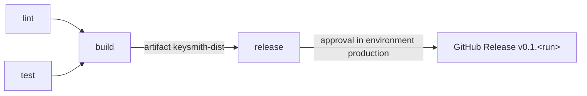

# keysmith

[](https://github.com/GitGitRice/keysmith/actions/workflows/pipeline.yml)

keysmith generates passwords and secret tokens in the browser. It is one HTML file. It runs
offline and sends nothing over the network.

keysmith is also the project for the Syntax Institut course task "Eigene CI/CD-Pipeline"
(Modul 4, Tag 5). The GitHub Actions pipeline tests, builds and releases it.

## What it does

keysmith has two generators:

| Generator    | Input                                                            | Default  | Minimum  |
| ------------ | ---------------------------------------------------------------- | -------- | -------- |
| Password     | Length; character classes: lowercase, uppercase, digits, symbols | 20 chars | 8 chars  |
| Secret token | Number of random bytes; encoding: hex or base64url               | 32 bytes | 16 bytes |

- Each enabled character class appears at least once in a password.
- A secret token is for machine use: `.env` values, API keys, session secrets.
- keysmith calculates the estimated strength (entropy, in bits) of each result. The user interface shows it next to the result.
- keysmith also shows the average time an attacker needs to find the value (crack time), for
  three attack types:

  | Attack type               | Guesses per second | Example                                  |
  | ------------------------- | ------------------ | ---------------------------------------- |
  | Online-Login              | 10                 | Guesses through a login form.            |
  | Datenleck, langsamer Hash | 10 000             | Stolen database with bcrypt or Argon2.   |
  | Datenleck, schneller Hash | 100 000 000 000    | Stolen database with MD5, SHA-1 or NTLM. |

  The average time is 2^(bits − 1) / guesses per second. The rates are rough orders of
  magnitude. The estimate is only for random values. A name or a word is much weaker, because
  attackers try word lists first.

The page shows both generators at the same time. A value appears only after a click on
**Passwort generieren** or **Secret-Token generieren**. If you change an option, the old
value stays, and a hint asks you to generate a new value. **Kopieren** copies the value and shows **Kopiert ✓**. A panel to the right of each
generator shows the entropy and the crack times. On narrow screens the panel is below the
generator.

The user interface is in German and English. keysmith uses the language of your browser if it
is one of the two, else German. The **DE / EN** switch at the top right changes the language.
The page follows the light or dark mode of your system. The button next to the language switch
changes the mode. The browser remembers both choices.

## Security notes

- **Generation happens only in your browser.** Randomness comes from `crypto.getRandomValues`.
  keysmith never uses `Math.random`.
- **Uniform sampling.** keysmith picks each character with exactly equal chance. It uses rejection
  sampling, so there is no modulo bias. A test checks the distribution over many draws.
- **No external requests.** The build inlines all JavaScript and CSS into one `index.html`. There
  is no CDN, no web font and no analytics.
- **Content-Security-Policy.** The build adds a CSP `<meta>` tag to `index.html`. It allows only
  the inlined script and style of that build, by their SHA-256 hashes. It blocks all network
  requests, frames and form submissions. The dev server (`npm run dev`) runs without this tag,
  because the tag blocks the dev server's own scripts.

## Use a release

1. Open the [latest release](https://github.com/GitGitRice/keysmith/releases/latest).
2. Download `keysmith-0.1.<n>.zip` and unzip it.
3. Open `index.html` with a double-click. You need no server and no internet connection.

Some browsers block the clipboard API for pages from `file://`. Then **Kopieren** uses a
fallback. If both fail, the button shows **Fehlgeschlagen**. Then select the value and copy it by
hand.

## Run locally

You need Node.js 24 (see `.nvmrc`) and npm.

```sh
git clone https://github.com/GitGitRice/keysmith.git
cd keysmith
npm ci
npm run dev
```

`npm run dev` starts a local server. Open the URL that it prints.

| Command                | What it does                                                   |
| ---------------------- | -------------------------------------------------------------- |
| `npm run dev`          | Starts the development server.                                 |
| `npm run test`         | Runs the unit tests (Vitest).                                  |
| `npm run lint`         | Runs ESLint.                                                   |
| `npm run format:check` | Checks the formatting (Prettier). `npm run format` fixes it.   |
| `npm run typecheck`    | Checks the types of the app and the tests (TypeScript).        |
| `npm run build`        | Builds the single file `dist/index.html`.                      |
| `npm run preview`      | Serves the build output.                                       |
| `npm run ci`           | Runs lint, format check, typecheck, tests and build, in order. |

Run `npm run ci` before you push. It runs the same checks as the pipeline, except actionlint.

## Pipeline

The pipeline is one workflow: [`.github/workflows/pipeline.yml`](.github/workflows/pipeline.yml).



| Job       | What it does                                                                | Runs when            |
| --------- | --------------------------------------------------------------------------- | -------------------- |
| `lint`    | ESLint, Prettier check, TypeScript check, actionlint (checks the workflow). | Always               |
| `test`    | Unit tests with Vitest.                                                     | Always               |
| `build`   | Builds `index.html`, zips it, uploads the zip as the artifact.              | After `lint`, `test` |
| `release` | Checks the demo secret, downloads the artifact, creates the GitHub Release. | Push to `main` only  |

- `lint` and `test` run in parallel. `build` starts only when both pass.
- The artifact `keysmith-dist` holds only the zip. It is built once. `release` uses that same
  file, so the release contains exactly what the pipeline tested and built.
- `lint`, `test` and `build` set up Node from `.nvmrc` and cache npm downloads.
- All actions are pinned to a full commit SHA. A changed tag cannot change what runs.

### Triggers

| Event                      | Jobs that run                                   |
| -------------------------- | ----------------------------------------------- |
| Pull request to `main`     | `lint`, `test`, `build`. `release` is skipped.  |
| Push to `main` (merged PR) | All four jobs. `release` waits for an approval. |

The `if:` condition on `release` allows only a push to `main`.

### Permissions

- The workflow has only `contents: read`.
- Only `release` gets more: `contents: write` (create the tag and the release) and
  `actions: read` (download the artifact).

### Secrets and environment

| Name           | Type                                   | Used by   | Purpose                                   |
| -------------- | -------------------------------------- | --------- | ----------------------------------------- |
| `GITHUB_TOKEN` | Automatic token from GitHub Actions    | `release` | Lets `gh` create the release.             |
| `DEPLOY_TOKEN` | Secret of the environment `production` | `release` | **Course demonstration only.** See below. |

`DEPLOY_TOKEN` has a made-up value. keysmith does not need it. It shows how a job reads an
environment secret without printing it. The job passes the secret to the shell through `env:` and
prints only its length. GitHub masks the value as `***` in the log. The step fails if the secret
is empty.

The environment `production` has two protection rules:

- **Required reviewer:** the repo owner must approve each release run.
- **Deployment branch:** only `main` can deploy.

### Deployment

The deployment is a GitHub Release. After the approval, `release` runs:

```sh
gh release create "v0.1.<run_number>" dist/*.zip --generate-notes --target <commit sha>
```

- The version is `0.1.<run_number>`. The run number goes up with each pipeline run, so each
  release has a new version.
- `--target` puts the tag on the commit that the pipeline built, not on a newer commit.
- `--generate-notes` writes the release notes from the merged pull requests.

### Repository security

- **Branch rules on `main`.** A ruleset blocks direct pushes, force pushes and deletion of
  `main`. Each change needs a pull request. The pull request can merge only when `lint`, `test`
  and `build` pass, and only as a squash merge.
- **CodeQL.** [`.github/workflows/codeql.yml`](.github/workflows/codeql.yml) scans the
  TypeScript code and the workflow files. It runs on each pull request, on each push to `main`
  and once a week. Results show in the tab **Security → Code scanning**.
- **Dependabot.** [`.github/dependabot.yml`](.github/dependabot.yml) checks npm packages and
  actions once a week and opens a pull request for each update. It also updates transitive npm
  packages. It skips new major versions of `typescript` and `@types/node`: `typescript-eslint`
  does not support TypeScript 7 yet, and `@types/node` must match the Node version in `.nvmrc`.
  Dependabot alerts and security updates are on.
- **Reporting.** See [SECURITY.md](SECURITY.md).

## Project layout

```
src/lib/    generator logic: random.ts, password.ts, token.ts, entropy.ts, crack-time.ts
src/main.ts user interface (with index.html, src/style.css and src/i18n.ts, the German and English texts)
build/      Vite plugin that adds the Content-Security-Policy tag
tests/      unit tests
docs/adr/   architecture decision records
docs/final-challenge.md  result table of the final challenge
CONTEXT.md  glossary of the terms in this repo
```

## Final challenge

The course's final challenge (debug a broken pipeline with six problems) ran in the separate
repo [pipeline-challenge](https://github.com/GitGitRice/pipeline-challenge). The result table
with symptom, cause and fix of each problem is in
[docs/final-challenge.md](docs/final-challenge.md)
(German: [docs/final-challenge.de.md](docs/final-challenge.de.md)).

## License and credits

MIT. See [LICENSE](LICENSE).

- Built with [Vite](https://vite.dev),
  [vite-plugin-singlefile](https://github.com/richardtallent/vite-plugin-singlefile),
  [Vitest](https://vitest.dev) and [TypeScript](https://www.typescriptlang.org).
- Course task: Syntax Institut, Modul 4 (DevOps), Tag 5.
